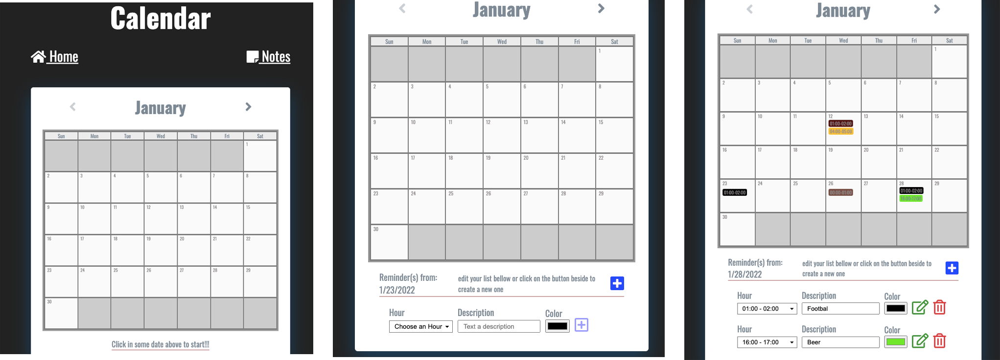

<h1 align="center">
 
Calendar
</h1>

A simple calendar able to apply some notes using REACT + REDUX

  

## Features
- **React Js**
- **Redux**
- **Sass**

## Getting started

- run the command: npm i
- run the command: npm run start

## NOTES
This app is based on REACT FUNCTIONS and also is using REDUX. Be aware to have installed MONGODB on your local machine!